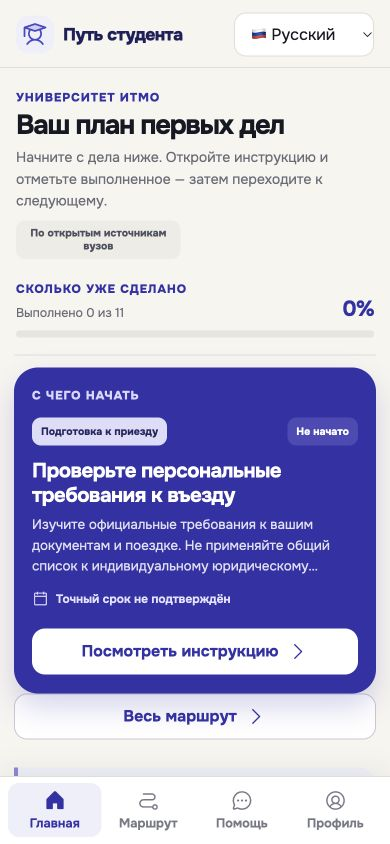
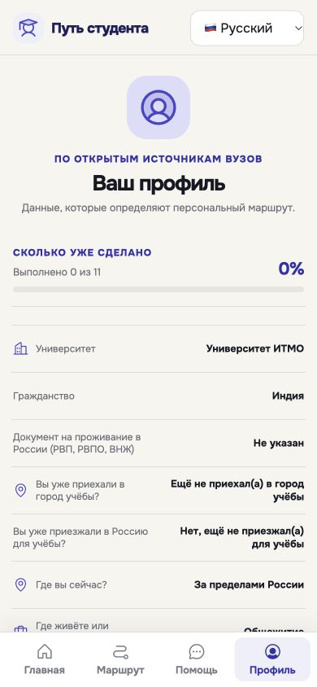
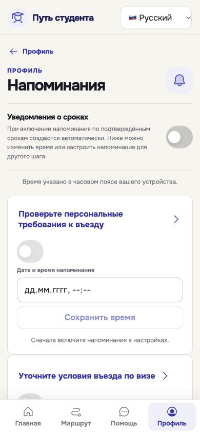

# Путь студента

**Команда «Национальные Приоритеты» · Хакатон MAX · Трек «Забота о людях»**

MAX-бот и мини-приложение для адаптации после зачисления: иностранных студентов и российских студентов, переехавших в другой город. Результат для пользователя — личный маршрут с ближайшим действием, инструкциями и источниками, сохранённым прогрессом и напоминаниями.

| Доступ | Ссылка / значение |
| --- | --- |
| Начало основного сценария | [Бот @t276_hakaton_max_bot в MAX](https://max.ru/t276_hakaton_max_bot) → `/start` |
| Мини-приложение | https://student-way.tw1.su/ — открывать из бота для входа через MAX |
| Собственное API / документация | https://student-way.tw1.su / https://student-way.tw1.su/docs |
| Git-репозиторий | https://github.com/VladislavBitIT/student-path |
| Зафиксированная версия исходников | Git-коммит, на который указывает тег `hackathon-2026-09-30-ui-final` |
| Выпуск | https://github.com/VladislavBitIT/student-path/releases/tag/hackathon-2026-09-30-ui-final |
| Локальный запуск | `docker compose up --build` из этой папки |
| Локальные логины, пароли и ключи | Вводить не требуется: Compose содержит учебные значения, dev-вход создаёт синтетический профиль |
| Доступ в настоящий MAX | Собственный аккаунт MAX; отдельного пароля приложения и административной роли для сценария нет |

## Где код и на чём написан проект

**Исходный код находится прямо в этой папке, без вложенного ZIP. Основной язык — TypeScript.** Файлы `.ts` — текст программ; `.tsx` — код интерфейса React. Их открывают обычным текстовым редактором или редактором кода. Здесь `.ts` не является видеоформатом. Видео имеют расширение `.mp4` и лежат в `assets/bot-intro/`.

| Что делает компонент | Где посмотреть настоящий код | Технология |
| --- | --- | --- |
| Экраны анкеты, маршрута, профиля, помощи и напоминаний | [apps/miniapp/src/App.tsx](apps/miniapp/src/App.tsx); [оформление](apps/miniapp/src/styles.css) | TypeScript + React, сборка Vite |
| HTTP-сервер: запросы приложения, вход, профиль и маршрут | [apps/api/src/app.ts](apps/api/src/app.ts); [точка запуска](apps/api/src/index.ts) | TypeScript + Fastify на Node.js |
| Команды и кнопки MAX-бота | [packages/application/src/bot-handler.ts](packages/application/src/bot-handler.ts); [запуск бота](apps/bot/src/index.ts) | TypeScript, адаптер MAX |
| Правила построения персонального маршрута | [packages/domain/src/route-engine.ts](packages/domain/src/route-engine.ts); [сервис маршрута](packages/application/src/route-service.ts) | Детерминированные правила |
| Напоминания и очередь отправки | [packages/application/src/worker.ts](packages/application/src/worker.ts); [запуск обработчика](apps/worker/src/index.ts) | TypeScript, отдельный процесс |
| Обмен с платформой MAX и проверка данных входа | [packages/max-adapter/src/](packages/max-adapter/src/) | Реальный и локальный тестовый адаптеры |
| Схема базы, справочники и исходные материалы | [db/](db/); [загрузка справочника](apps/api/src/seed.ts) | PostgreSQL, SQL, JSON |
| Автоматические проверки | [tests/](tests/); [основной HTTP-сценарий](scripts/demo-smoke.ts) | Vitest и TypeScript |

`apps/` — запускаемые приложения; `packages/` — общая логика, которую они используют. `.json` в `db/` содержит данные и правила, `.yaml` описывает конфигурацию запуска или проверки API. Dockerfile и Compose задают воспроизводимую сборку и запуск. Shell-файлы `.sh` — вспомогательные команды; основные функции продукта написаны в `.ts`/`.tsx`.

### Как связаны части

```text
Студент в MAX → бот → мини-приложение React
                              ↓ HTTP-запросы и сессия
                         сервер Fastify
                        ↙              ↘
             правила маршрута       PostgreSQL
                                     профиль, шаги,
                                     прогресс, напоминания
                                           ↓
                                  обработчик напоминаний
                                           ↓
                                      адаптер MAX → бот → студент
```

Например, студент завершает шаг в интерфейсе. Мини-приложение отправляет запрос в API; сервер проверяет сессию, обновляет состояние в PostgreSQL, пересчитывает прогресс и возвращает обновлённый маршрут. Интерфейс показывает новое ближайшее действие. Ответы справочной помощи опираются на найденные материалы; язык интерфейса и правила маршрута не зависят от генерации текста моделью.

Далее: [запуск](#запуск-одной-командой) · [сценарий проверки](#сценарий-проверки-и-ожидаемое-поведение) · [проверка API](#воспроизводимая-проверка-api) · [данные](#архитектура-и-данные) · [границы проверки](#проверки-и-известные-ограничения).

## Интерфейс

<p>
  
  
  
</p>

Актуальные снимки синтетического профиля из локального браузера при ширине 390 px. Дополнительно: [анкета](screenshots/onboarding.png), [маршрут](screenshots/route.png). Проверка внутри MAX выполняется отдельно.

## Доступ для проверки

- Бот: [@t276_hakaton_max_bot](https://max.ru/t276_hakaton_max_bot).
- Мини-приложение: <https://student-way.tw1.su/>. Основной сценарий начинают из бота, а не по прямой ссылке в обычном браузере.
- API: <https://student-way.tw1.su/docs>; публичная готовность: <https://student-way.tw1.su/health/ready>.

Отправьте `/start`, выберите язык, прочитайте приветствие и откройте приложение под видео. Повторный `/start` снова показывает приветствие и языки, сохраняя профиль, прогресс и напоминания. Для теста используйте собственный аккаунт MAX и вымышленные обстоятельства. HTTP 200 и локальный mock-сценарий не подтверждают вход и доставку уведомлений в настоящем клиенте MAX.

## Исходники и версия

Текущий выпуск: [hackathon-2026-09-30-ui-final](https://github.com/VladislavBitIT/student-path/releases/tag/hackathon-2026-09-30-ui-final). Исходный коммит разработки и серверный выпуск: `727e351bbcf8c4d2b75fbc24f4101bcad2e7397e`. Публичный Git-коммит этого репозитория указан у тега выпуска; отдельный SHA-256 фиксирует конкурсный ZIP в приложениях к выпуску.

Внесены согласованные правки: вопросы о текущем местонахождении и приезде для учёбы показываются последовательно; уточнения применимости шагов доступны в профиле вместо списка возможных действий на странице маршрута; прогресс содержит одну строку выполнения. Переводы обновлены на семи языках. Исправлена валидация API уточнений, которая превращала логические ответы в строки и отклоняла их с 422. Справочник, доменные правила и зависимости сохранены.

Развёрнутая версия проверяется отдельно от GitHub: сведения о серверном выпуске и проверках опубликованы в описании release. Снимки экрана сделаны в локальной среде; они не заменяют ручную проверку внутри MAX. Прежний тег `hackathon-2026-09-30` сохранён как предыдущий выпуск.

`SOURCE_PROVENANCE.json` описывает происхождение кода и данных. Конкурсный ZIP дополнительно содержит `SUBMISSION-MANIFEST.json` и `SHA256SUMS.txt`. После добавления PDF-презентации контрольная сумма итогового ZIP должна быть пересчитана. Презентация пока не входит в этот выпуск.

## Запуск одной командой

Нужны запущенный Docker Desktop/Engine с Compose v2 или новее, свободные порты 3000, 4173, 54329 и сеть для загрузки контейнерных образов и npm-зависимостей. На Windows используйте Docker Desktop с Linux-контейнерами. Отдельно устанавливать Node.js, pnpm или PostgreSQL для Docker-сценария не нужно.

Распакуйте ZIP и откройте терминал **в папке `student-path`, где лежат этот README, Dockerfile и `compose.yaml`**. Одна команда запускает все локальные компоненты:

```sh
docker compose up --build
```

Для получения этой версии через Git:

```sh
git clone https://github.com/VladislavBitIT/student-path.git
cd student-path
git checkout hackathon-2026-09-30-ui-final
docker compose up --build
```

В конкурсном ZIP исключены только файлы администрирования production; код приложения совпадает с этим выпуском.

Команда запускает PostgreSQL, применяет миграции и справочник, затем запускает API, bot, worker и miniapp. Для этого локального режима не нужно заполнять `.env` или получать внешние ключи. Настройки Compose используют публичные учебные значения и имитацию MAX.

После готовности сервисов:

| Адрес                                       | Назначение                                           |
| ------------------------------------------- | ---------------------------------------------------- |
| <http://localhost:4173/?devUserId=review-1> | Новый синтетический профиль                          |
| <http://localhost:4173/?demo=completed>     | Пример с выполненным шагом                           |
| <http://localhost:3000/docs>                | HTTP API                                             |
| <http://localhost:3000/health/ready>        | Готовность API и базы                                |
| `localhost:54329`                           | Локальная PostgreSQL                                 |
| `localhost:54330`                           | PostgreSQL для тестов, только профиль Compose `test` |

Для нового тестового профиля меняйте номер в `devUserId`. На macOS при проблемах Docker с кириллицей в пути извлеките папку в путь латиницей или используйте `sh scripts/docker-compose-safe.sh up -d --build`.

```sh
# Перезапустить приложение, сохранив данные
docker compose restart api bot worker miniapp
# Остановить; том базы сохраняется
docker compose down
# Запустить снова
docker compose up -d
```

Для обычной остановки не добавляйте `-v`: этот флаг удаляет локальный том PostgreSQL.

## Сценарий проверки и ожидаемое поведение

1. Выберите язык, университет, гражданство, зачисление, обстоятельства приезда и жильё. Необязательные неизвестные ответы можно отложить. Создайте маршрут.
2. На Главной видны прогресс и одно ближайшее действие. Кнопка «Весь маршрут» открывает полный список. Откройте инструкцию: действие, применимость, документы и опубликованный источник. Этап маршрута не является дедлайном; неподтверждённая дата не выдумывается.
3. Нажмите «Начать выполнение», затем завершите шаг. Статус и прогресс обновляются; завершение доступно и без предварительного начала. После закрытия/повторного открытия данные сохраняются.
4. В профиле проверьте сохранение гражданства. У иностранного студента состоявшийся приезд для учёбы сохраняется при ответе «сейчас не в России». Изменение жилья применяется после подтверждения, прогресс применимых действий сохраняется.
5. Включите напоминания. Автоматические даты появляются только для допустимых правил с известными исходными событиями. Для незавершённого шага назначьте своё будущее время, измените его и отключите. Сохранённое время видно после повторного открытия; выключенный шаг не включается сам при пересчёте.
6. В настоящем MAX отдельно дождитесь собственного тестового напоминания и откройте из него шаг. В локальном Docker доставка имитируется. Проверка сохранённой даты не означает фактическую доставку в MAX.
7. Переключите язык в шапке, проверьте профиль и «Помощь». Подтверждённый факт сопровождается источником; при нехватке сведений точный срок не придумывается. Проверьте интерфейс с клавиатурой телефона.
8. Перезапустите контейнеры и снова откройте профиль: ответы и прогресс должны сохраниться.

Команда `/reset` в боте без дополнительного подтверждения удаляет данные текущего пользователя в приложении. Используйте её только для ненужного тестового профиля; данные других пользователей и переписку в MAX она не удаляет.

## Воспроизводимая проверка API

После `docker compose up -d --build --wait` основной сценарий запускается одной командой, без Node.js или pnpm на компьютере проверяющего:

```sh
docker compose exec -T api node dist/demo-smoke.js
```

Это собранный `scripts/demo-smoke.ts`, а не отдельный набор проверок. При запуске через macOS-обёртку используйте `sh scripts/docker-compose-safe.sh exec -T api node dist/demo-smoke.js`. Для разработки вне Docker после `pnpm install --frozen-lockfile` доступен тот же сценарий: `pnpm demo:smoke`.

Сценарий создаёт отдельного синтетического студента ИТМО, использует имитацию MAX и не требует рабочих секретов. Имя пользователя уникально для каждого запуска; повторный вход внутри запуска использует то же имя. Даты напоминаний вычисляются от текущего времени: +24 часа для создания и +48 часов для замены. Коды и UUID шагов берутся из ответа маршрута, токен — из ответа авторизации и хранится только в памяти процесса. Ошибка завершает команду с ненулевым кодом; успешные этапы перечисляются без токенов. В `finally` удаляется только созданный синтетический профиль. Итог успеха: `Mock demo smoke passed. Synthetic data only; real MAX video and delivery are not verified.`

Сценарий допускает только локальные адреса (`localhost`, `127.0.0.1`, `[::1]`, внутренний адрес Docker `api`) и перед входом требует `/health/ready` с `maxProvider: "mock"`. Не направляйте его или `/api/auth/dev` на опубликованный сервер. Локальная проверка не подтверждает воспроизведение видео и доставку напоминаний в настоящем MAX.

### Тестовые данные и доступ

В `test-data/` находятся [auth-dev.json](test-data/auth-dev.json) и [onboarding-foreign-itmo.json](test-data/onboarding-foreign-itmo.json) — готовые JSON-тела входа и анкеты для локальной проверки. Они не содержат реальные данные или секреты. Учётная запись создаётся локально первым запросом; фиксированного пароля нет. Для чистого повтора замените `devUserId` в запросе входа. Автоматическая проверка выше делает это сама.

1. В локальном `/docs` выполните `POST /api/auth/dev` с `auth-dev.json`.
2. В Authorize вставьте только полученное значение `token`, без префикса `Bearer`: Swagger добавляет его сам. Не сохраняйте сессию в файлы комплекта.
3. Выполните `POST /api/onboarding` с `onboarding-foreign-itmo.json`, затем следуйте таблице запросов ниже.
4. Код шага берите из своего ответа маршрута. Время ручного напоминания задавайте в будущем: фиксированная дата из примера могла бы устареть.

В настоящем MAX вход происходит через платформу. Тестовый профиль можно заполнить вымышленными обстоятельствами; пароль аккаунта MAX, токен бота и серверные ключи комиссии для этого не передаются. Отдельная заранее выданная сессия для автоматической проверки защищённых методов публичного API в комплекте отсутствует.

### Среды и авторизация

| Среда                                   | Адрес и доступ                                                                                 | Что проверяется                                                                                                                                                                                                 |
| --------------------------------------- | ---------------------------------------------------------------------------------------------- | --------------------------------------------------------------------------------------------------------------------------------------------------------------------------------------------------------------- |
| Опубликованный сервер                   | `https://student-way.tw1.su`; публичные GET без токена                                         | Только `/health/live`, `/health/ready`, `/api/legal` из `DATA-API.yaml`. Наличие legal-полей не означает, что сведения об операторе и поддержке утверждены.                                                     |
| Локальный Docker                        | `http://localhost:3000`; `POST /api/auth/dev` с синтетическим `devUserId`, далее Bearer-сессия | Полный последовательный сценарий ниже, с изменением только синтетических данных и доставкой через mock.                                                                                                         |
| Настоящий MAX, отдельная ручная приёмка | `POST /api/auth/max` с `{ "initData": "данные запуска из MAX" }`, далее выданная Bearer-сессия | Данные запуска подписаны MAX. Неверные/устаревшие данные дают 401, неверный JSON — 400, отсутствие настройки MAX — 503. Рабочие initData и токены в комплект не входят. Dev-вход при production возвращает 404. |

### Последовательность запросов

Роль «владелец» ниже означает текущего авторизованного пользователя, а не новую роль системы. Для неё обязателен `Authorization: Bearer <token>`. Во всех запросах используется `Accept: application/json`; при JSON-теле — `Content-Type: application/json`. Query-параметры не требуются. Успех — HTTP 200 и JSON с указанными обязательными полями; полные схемы вложенных объектов находятся в `openapi.json` и `/docs`.

| Шаг                     | Метод, путь, роль                                                                        | Тело / откуда берутся параметры                                                                         | Ожидаемые поля и проверка результата                                                                                                                                                                                                                  |
| ----------------------- | ---------------------------------------------------------------------------------------- | ------------------------------------------------------------------------------------------------------- | ----------------------------------------------------------------------------------------------------------------------------------------------------------------------------------------------------------------------------------------------------- |
| 1. Вход                 | `POST /api/auth/dev`, без сессии, только локально                                        | `{ "devUserId": "smoke-<уникальное значение>" }`                                                        | `token`, `user.id`, `user.maxUserId`, `user.preferredLanguage`; сохраняются в памяти.                                                                                                                                                                 |
| 2. Анкета               | `POST /api/onboarding`, владелец                                                         | JSON ниже                                                                                               | `route.id`, `route.steps`, `route.progress`, `route.nextAction`; есть применимые общие и вузовские действия.                                                                                                                                          |
| 3. Профиль              | `GET /api/profile`, владелец                                                             | Без тела                                                                                                | `user`, `profile`; после анкеты `profile` не null, вуз, язык и обстоятельства совпадают с отправленными.                                                                                                                                              |
| 4. Маршрут              | `GET /api/route`, владелец                                                               | Без тела                                                                                                | `route` с `id`, `version`, `stage`, `steps`, `possibleSteps`, `archivedCompleted`, `progress`, `nextAction`, `university`, `partnerStatus`, `disclaimer`.                                                                                             |
| 5. Ближайшее действие   | `GET /api/next-action`, владелец                                                         | Без тела                                                                                                | `nextAction`, `progress`; код действия и прогресс совпадают с маршрутом.                                                                                                                                                                              |
| 6. Инструкция           | `GET /api/route/steps/{idOrCode}`, владелец                                              | `idOrCode` — UUID или код из `route.steps`; сегмент URL кодируется                                      | `step.id`, `step.code`, `step.title`, `step.description`, `step.preparation`, `step.status`, `step.source`; проверяются непустые `step.knowledge.instructions` и `step.knowledge.sources[].title/url`. Верхнеуровневый `step.source` может быть null. |
| 7. Прогресс             | `PATCH /api/route/steps/{idOrCode}/status`, владелец                                     | Два последовательных тела: `{ "status": "IN_PROGRESS" }`, затем `{ "status": "COMPLETED" }`             | `route`; после начала статус изменён, после завершения `progress.completed` увеличен на 1, `total` сохранён, `percent` пересчитан. Повторное чтение подтверждает результат.                                                                           |
| 8. Согласие             | `POST /api/reminders/opt-in`, владелец                                                   | `{}`                                                                                                    | `remindersEnabled: true`.                                                                                                                                                                                                                             |
| 9. Создание напоминания | `POST /api/reminders`, владелец                                                          | `{ "stepCode": "<код другого незавершённого шага>", "scheduledFor": "<будущее время в ISO 8601 UTC>" }` | `reminder.id`, `reminder.userId`, `reminder.userStepId`, `reminder.scheduledFor`, `reminder.status`; время и шаг совпадают.                                                                                                                           |
| 10. Чтение и изменение  | `GET /api/reminders`, затем повторный `POST /api/reminders`, владелец                    | Тот же `stepCode`, другое будущее `scheduledFor`; затем снова GET                                       | `reminders[]` с `stepCode`, `scheduledFor`; для шага ровно одна запись с новым временем, старая дата отсутствует. Отдельного метода редактирования по ID нет.                                                                                         |
| 11. Отключение          | `PATCH /api/reminders/{code}`, владелец                                                  | `code` из шага 9; `{ "mode": "off" }`; затем `GET /api/reminders`                                       | `reminders`; активного напоминания для этого шага нет. Сохранённый режим `off` проверяется по профилю.                                                                                                                                                |
| 12. Повторный вход      | `POST /api/auth/dev`, затем `GET /api/profile`, `/api/route`, `/api/reminders`, владелец | Тот же `devUserId`, новая полученная сессия                                                             | Тот же `user.id`; профиль, выполненный шаг, прогресс и режим отключения сохранены. Отдельный повторный вход до отключения также подтверждает сохранение установленного времени.                                                                       |

Точное тело анкеты из сценария (отсутствие обстоятельств может выбрать другую ветку маршрута):

```json
{
  "preferredLanguage": "en",
  "universityCode": "ITMO",
  "campusCode": "main",
  "citizenshipType": "foreign",
  "citizenshipCountry": "KZ",
  "entryMode": "visa_free",
  "russiaPresence": "no",
  "studyArrival": "no",
  "mobilityStatus": "moving",
  "arrivalStatus": "preparing",
  "arrivalDate": null,
  "accommodationType": "dormitory"
}
```

`profile` содержит `userId`, `universityCode`, `arrivalStatus`, `arrivalDate` (дата или null), `accommodationType`, `remindersEnabled`, `attributes` и временные отметки; до анкеты он null. `progress` — `{ completed, total, percent }`. `nextAction` — объект шага или null, если действий нет. У шага `source` и `deadline` могут быть null: сценарий выбирает действие с источником, а отсутствие подтверждённой даты допустимо. Дополнительные поля действующего интерфейса сохраняются схемами сериализации.

Ошибки имеют поля `code`, `message`, `requestId`. Защищённые методы требуют сессию (401 при отсутствии/невалидном токене для корректно сформированного запроса); неверные параметры, JSON или статус дают 400. Деталь/статус чужого либо отсутствующего UUID шага дают 404. Для маршрута/шага возможен 404 до создания профиля; анкета возвращает 409 при необходимости подтверждения изменения и 422 при противоречивых обстоятельствах. Напоминания возвращают 409 без согласия, 404 для неподходящего шага и 422 для прошедшей даты. Точная матрица ответов каждого метода — в OpenAPI. Изоляция пользователей, отсутствие авторизации и сохранность сериализованных полей проверяются существующими интеграционными тестами `tests/integration/api.test.ts` на отдельной PostgreSQL.

Существующий smoke дополнительно проверяет ровно одну доставку в mock, подтверждение изменения проживания с сохранением выполненного шага и безопасный ответ на вопрос вне справочника. Dev-методы тика worker, чтения mock-доставок и удаления своего синтетического профиля доступны только в local mock-режиме; реальные MAX-сообщения не отправляются.

## DATA-API 1.0

Корневой `DATA-API.yaml` описывает публичные повторяемые проверки `/health/live`, `/health/ready` и `/api/legal` для `https://student-way.tw1.su`. Официальный формат поддерживает `dependsOn` и `extract`, но задаёт один HTTPS `baseUrl`: локальный сценарий с изменением данных вынесен в существующий `scripts/demo-smoke.ts` и описан выше. Это разделение сред, а не собственное расширение формата. Dev-вход и рабочие секреты в публичный YAML не включены. `openapi.json` генерируется из схем Fastify командой `pnpm openapi:generate`; `pnpm openapi:check` проверяет актуальность.

Проверка использует официальную схему и программу проверки из [репозитория DATA-API](https://gitverse.ru/stasnorman/example-data-api), закреплённые по версии и контрольной сумме. Нужны Git, Python 3 и сеть для установки зависимостей во временный каталог:

```bash
pnpm validate:data-api
```

## Архитектура и данные

React/Vite (`apps/miniapp`) обращается к Fastify API (`apps/api`). API проверяет вход MAX, сохраняет профиль и прогресс в PostgreSQL и строит маршрут детерминированными правилами из `packages/domain`. `apps/bot` обрабатывает входящие события, `apps/worker` — напоминания и очередь доставки. Общие сценарии находятся в `packages/application`, адаптер MAX — в `packages/max-adapter`.

Справочник и миграции находятся в `db/`. Изменения схемы и повторное заполнение справочника выполняются при старте API; пользовательские записи хранятся в томе PostgreSQL. В архив не включены реальные профили, журналы переписки, дампы, рабочие env-файлы или закрытые ключи.

Зависимости закреплены в `pnpm-lock.yaml`; Docker использует `pnpm install --frozen-lockfile`. Для команд вне Docker нужны Node.js 22–25 и pnpm 10.33.0; контейнеры используют Node.js 22.22 и PostgreSQL 17.

## Переменные и внешние сервисы

Полный локальный пример — `.env.example`; шаблон серверной конфигурации — `deploy/production.env.example`. Реальные значения задаются отдельно в окружении сервера. Локальный Compose уже содержит необходимые настройки.

| Переменные                                                                   | Назначение                                          |
| ---------------------------------------------------------------------------- | --------------------------------------------------- |
| `DATABASE_URL`, `SESSION_SECRET`                                             | Подключение к базе и подпись сессий                 |
| `APP_BASE_URL`, `MINIAPP_PUBLIC_URL`, `ALLOWED_ORIGINS`, `API_PORT`          | Адреса, допустимые origins и порт API               |
| `MAX_PROVIDER`, `MAX_UPDATE_MODE`                                            | Локально `mock`; на сервере `real` и `webhook`      |
| `MAX_BOT_TOKEN`, `MAX_BOT_USERNAME`                                          | Настоящий бот; токен хранится только на сервере     |
| `MAX_WEBHOOK_PUBLIC_URL`, `MAX_WEBHOOK_SECRET`, `MAX_INIT_DATA_TTL_SECONDS`  | Входящие события и проверка запуска MAX             |
| `MAX_INTRO_VIDEO_RU_TOKEN`, `MAX_INTRO_VIDEO_EN_TOKEN`                       | Идентификаторы загруженных видео для настоящего MAX |
| `LLM_PROVIDER`, `LLM_BASE_URL`, `LLM_API_KEY`, `LLM_PROJECT_ID`, `LLM_MODEL` | Внешний Alice; локально `LLM_PROVIDER=none`         |
| `DEFAULT_TIMEZONE`, `WORKER_POLL_INTERVAL_MS`, `LOG_LEVEL`                   | Часовой пояс, опрос очереди и журналирование        |

Настоящий MAX требует внешнего аккаунта бота, привязки мини-приложения, HTTPS и серверных секретов. Alice требует проекта провайдера, ключа и сети; получает обработанный вопрос, найденные источники и ограниченный контекст профиля. Локальные компоненты воспроизводятся в Docker, внешние аккаунты — нет. Без Alice локально используется поиск по справочнику. Контейнеризация не заменяет доступное решение в MAX.

## Проверки и известные ограничения

Текущие UI-правки: 41 тест интерфейса, один адресный HTTP-интеграционный тест сохранения/сброса ответов, TypeScript, ESLint и сверка переводов пройдены. Остальные 38 API-тестов в этом адресном прогоне не запускались. Сборка Docker и HTTP smoke пройдены в отдельной локальной среде с mock MAX; для изоляции использовались другие localhost-порты и соответствующий URL API во frontend. Далее приведены также прежние результаты базового комплекта — они не означают повторный запуск полного набора тестов для этой правки.

| Что подтверждено | Основание и граница вывода |
| --- | --- |
| Предыдущий публичный коммит `5df2372` | Историческая проверка исходного комплекта; текущая версия фиксируется новым тегом `hackathon-2026-09-30-ui-final` |
| Архив читается и полностью распаковывается; состав и контрольные суммы совпадают | Повторная проверка подготовленного ZIP; прикладные файлы сопоставлены с Git-снимком |
| Локальная сборка из извлечённого комплекта | 85,78 секунды, кеш сборки отключён, базовые образы уже доступны. Собраны API, bot, worker, miniapp; менее 5 минут по условиям ТЗ. Время зависит от компьютера и сети |
| Запуск и основной сценарий из извлечённого комплекта | Пять сервисов исправны; повторно пройден локальный mock-сценарий: анкета, профиль, маршрут, инструкция, прогресс, создание/замена/отключение напоминания, сохранение после повторного входа и одна mock-доставка. Синтетический профиль и тестовые контейнеры/том удалены |
| Публичные `/health/live` и `/health/ready` ответили успешно | Проверено при упаковке; `database: ok`, `maxProvider: real`. Это проверка доступности, а не всего сценария |
| 41 интеграционная проверка и 5 проверок защиты smoke; TypeScript, OpenAPI, официальный валидатор DATA-API; локальный Docker и основной mock-сценарий | Результат разработки исходного комплекта от 30.09.2026, зафиксирован в `SOURCE_PROVENANCE.json`. В этой задаче весь набор тестов заново не запускался |
| Пять снимков в `screenshots/` | Обновлены на локальной UI-версии с синтетическим профилем; не доказательство работы внутри MAX |

**Неподтверждённое и ограничения:**

- Ручное прохождение в мобильном и веб-клиенте MAX, воспроизведение видео и фактическая доставка напоминания требуют отдельной приёмки. Они не подтверждаются автоматическими тестами.
- Сервер обновлён до коммита разработки `727e351bbcf8c4d2b75fbc24f4101bcad2e7397e`. 30.09.2026 в 11:38 МСК сверены 951 исходный файл, работающие контейнеры, публичные JS/CSS и OpenAPI. Пять локальных mock-методов `/api/dev/*` ожидаемо отсутствуют в production. Это не заменяет ручную приёмку MAX.
- `DATA-API.yaml` содержит только три публичные проверки. Основной сценарий API воспроизводится локально через smoke. Требование ТЗ о перечне основных методов в DATA-API закрыто не полностью; наличие YAML и успешная проверка его формата не устраняют этот пробел.
- Десять вузов представлены по открытым источникам; партнёрство и подтверждение маршрутов вузами не заявляются.
- Некоторые действия требуют уточнения обстоятельств и актуального источника. Приложение не назначает точную дату без подтверждённого правила и исходного события; данные кампании 2026 не становятся постоянным сроком. Визовый режим не определяется автоматически только по гражданству.
- Семь языков относятся к интерфейсу: русский, английский, казахский, узбекский, туркменский, упрощённый китайский и хинди. Часть исходных инструкций остаётся на русском. Видео есть на русском и английском; для остальных языков используется английское, часть его экранов русскоязычная.
- Сведения об операторе данных и действующий контакт поддержки не утверждены; это отражено в `/api/legal`. Пакет не выдаёт их за заполненные.
- PDF-презентация подготавливается командой отдельно и обязательна для сдачи. Этот README её не заменяет.

## Проверки разработки

```sh
corepack enable
pnpm install --frozen-lockfile
pnpm test:unit
pnpm typecheck
pnpm lint
pnpm validate:content
pnpm validate:i18n
pnpm openapi:check
pnpm validate:data-api
pnpm build
```

`pnpm demo:smoke` проверяет локальный сценарий после запуска Compose. Интеграционные тесты запускаются через `pnpm test:integration` с `TEST_DATABASE_URL` отдельной тестовой базы; рабочую базу для них не используйте.


## Продуктовая логика, эффект и развитие

### Пользователь и проблема

Приоритетный сегмент — иностранный студент после зачисления, который готовится приехать или уже приехал в город обучения. Вторая поддерживаемая группа — российский студент после переезда в другой город. Поступление, выбор программы и подача заявления в вуз не являются основным сценарием продукта.

После зачисления студенту нужно сопоставлять обстоятельства приезда, проживания и обучения с инструкциями разных подразделений. Информация о заселении и документах размещена на отдельных официальных страницах. Например, в базе источников выделены страницы [заселения ИТМО](https://student.itmo.ru/ru/campus/dorms_and_aparts/booking), [миграционных документов ИТМО](https://int.itmo.ru/ru/important_documents) и [информации КФУ для иностранных студентов](https://kpfu.ru/international/inostrannomu-studentu). Их реквизиты и результаты проверки сохранены в [реестре источников](db/knowledge-release-2026-09-29/audit/source_registry.json) выпуска от 29.09.2026. Здесь не заявляется новая проверка всех внешних страниц на дату упаковки.

Рабочая гипотеза: в такой ситуации человеку трудно определить, какое действие относится именно к нему, что делать следующим и какие документы подготовить. Наличие раздельных инструкций обосновывает выбор сценария; проведённые интервью, число пользователей, снижение ошибок и экономия времени не заявляются — таких подтверждённых результатов в комплекте нет.

### Что получает студент

| Обычно требуется | Что делает MVP |
| --- | --- |
| Самостоятельно искать и сопоставлять разрозненные инструкции | Подбирает применимые общие и вузовские шаги по анкете |
| Самостоятельно выбирать следующее действие | Показывает ближайшее действие, полный маршрут и прогресс |
| Возвращаться к инструкциям и помнить, что уже сделано | Сохраняет состояние шагов и профиль |
| Держать даты в памяти | Позволяет включать напоминания по допустимым правилам или задавать своё время |
| Искать объяснение незнакомого требования | Даёт инструкцию и источник; помощь отвечает в пределах доступных материалов |

Продукт не подаёт заявления в ведомства, не получает статус реальных государственных заявлений, не подтверждает исполнение обязанности государственным органом и не подключён к закрытым информационным системам вузов. «Шаг выполнен» — отметка самого студента. Назначенная пользователем дата — его напоминание, а не установленный организацией срок.

### Данные и интеграции: что реально, что моделируется

- Открытые справочные данные: десять вузов — МГУ, НИЯУ МИФИ, МФТИ, НИУ ВШЭ, НГУ, СПбГУ, ТГУ, ИТМО, КФУ, РУДН. Это охват справочника, не список партнёров и не подтверждённое внедрение. Источники, применимость, ограничения и датировка связаны с карточками действий.
- Профиль и прогресс: сведения, введённые пользователем, и состояния шагов в PostgreSQL. Набор хранимых полей и запросы показаны выше. Реальные профили, сессии и переписка не входят в архив.
- MAX: предусмотрены адаптер реальной платформы и локальная имитация. В Docker используется только mock; он не отправляет сообщения человеку.
- Alice: внешний генеративный сервис для справочной помощи при настроенном провайдере; локально отключён, доступен поиск по материалам. Маршрут строится правилами, а не свободным предположением модели.
- Госуслуги, МВД и внутренние системы вузов: прямые интеграции не реализованы. Ссылки на официальные материалы не являются такими интеграциями.

### Ожидаемый эффект и способ измерения

Эффект пока является гипотезой. План проверки — сравнить одинаковые сценарии поиска по официальным страницам и работы с маршрутом на синтетических профилях, затем подтвердить результат в добровольном ограниченном пилоте.

| Показатель | Как измерять | Ожидаемое направление, без неподтверждённых чисел |
| --- | --- | --- |
| Время до определения первого применимого действия | От начала сценария до выбора действия и открытия подходящего источника | Сокращение |
| Доля завершивших основной сценарий без подсказки | Создан маршрут, открыта инструкция, отмечен шаг / число начавших | Рост |
| Ошибки применимости | Неподходящие действия по независимой проверке правил / проверенные действия | Снижение |
| Понятность следующего шага | Ответ пользователя, что, где и на каком основании он должен сделать | Рост доли корректных ответов |
| Доставка и открытие напоминания | Проверять отдельно в реальном MAX на согласованных тестовых аккаунтах | Подтверждённая доставка, отсутствие дублей |

Метрики ещё не измерены; целевые проценты и достигнутые улучшения не подменяются предположениями.

### Пилот и масштабирование — предложение, не выполненные работы

Первый пилот предлагается ограничить одним вузом, одним кампусом и сценарием приезда после зачисления. Конкретная площадка и участники пока не согласованы. До пилота нужны ответственный за проверку контента, утверждённые сведения об операторе и поддержке, ручная приёмка мобильного и веб-MAX и способ проверки защищённого API.

После этого — приглашение добровольцев через согласованный канал, прохождение одинаковых задач, фиксация ошибок и метрик выше, затем решение о расширении. Пилот не требует имитировать доступ к государственным базам: ценность проверяется на маршруте, инструкциях и сохранении прогресса.

| Этап расширения | Что сохраняется | Что нужно адаптировать и проверить |
| --- | --- | --- |
| Другой кампус выбранного вуза | Бот, интерфейс, профиль, прогресс, механизм напоминаний | Адреса и подразделения, размещение, сроки и события, локальные источники |
| Другой вуз из справочника | Архитектура и основные типы шагов | Подтверждение актуальности карточек, ответственный редактор, сценарии конкретного вуза |
| Новый вуз или регион | Общий механизм персонального маршрута | Новый пакет данных, локальная применимость, календарь, проверка ссылок и тестовые профили |
| Новые языки и группы студентов | Техническая основа интерфейса | Перевод инструкций и источников, проверка терминов носителями, новые правила применимости |

Основные риски расширения — устаревание материалов, разные процедуры кампусов, неполные исходные обстоятельства, ошибки перевода и зависимость доставки от платформы. Меры: версионирование источников и правил, ответственный за актуальность, ограничение неподтверждённых сроков, проверка каждого нового сценария. Эти меры дальнейшего внедрения не выдаются за уже согласованный процесс с вузами.
